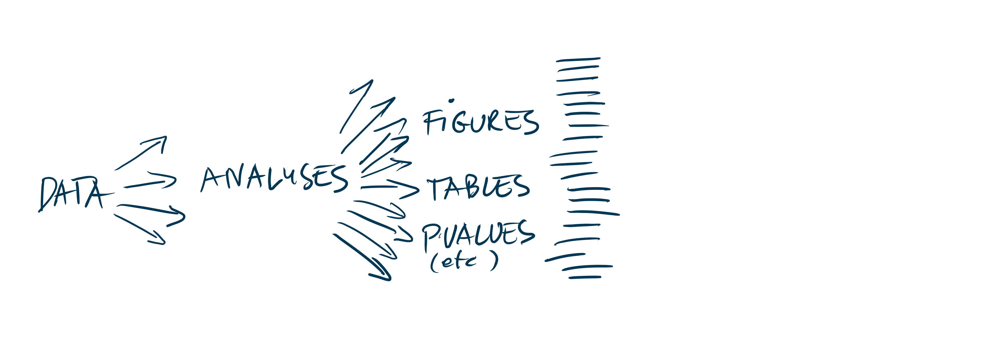
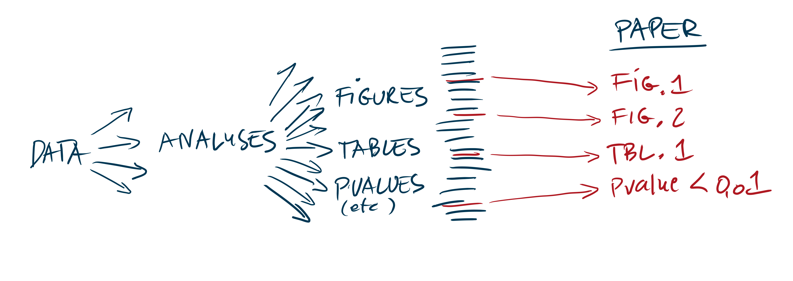
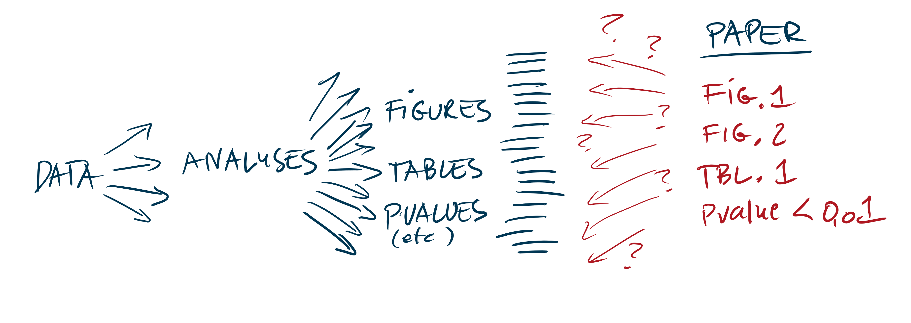
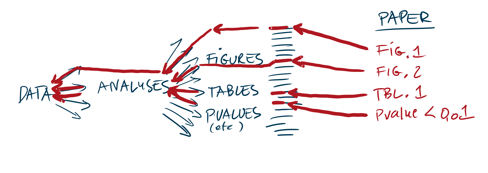
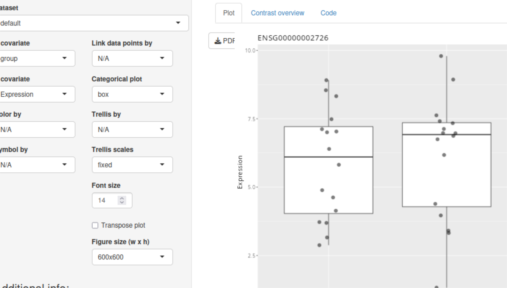
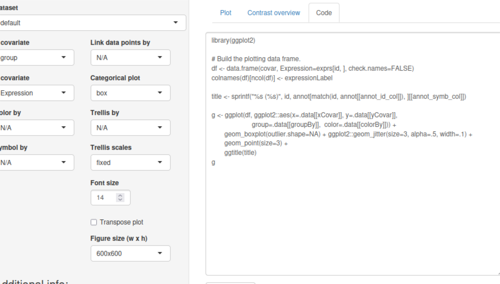
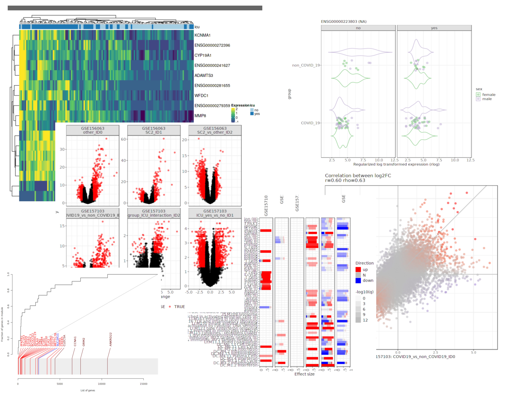

## The CUBI environment

:::: {.columns}

::: {.column width="25%"}

 * Clinical and translational research
 * Large university hospital and related institutions (BIH, MDC, Charité)

:::
::: {.column width="5%"}
:::

::: {.column width="70%"}


:::
::::

## The CUBI environment

:::: {.columns}

::: {.column width="25%"}

 * Clinical and translational research
 * Large university hospital and related institutions (BIH, MDC, Charité)

:::
::: {.column width="5%"}
:::

::: {.column width="70%"}


:::
::::

## The CUBI environment

:::: {.columns}

::: {.column width="25%"}

 * Clinical and translational research
 * Large university hospital and related institutions (BIH, MDC, Charité)

:::
::: {.column width="5%"}
:::

::: {.column width="70%"}


:::
::::


## Reproducibility vs Accountability



In a high-throughput bioinformatic project, a lot of analyses, models, figures,
tables are generated. 

## Reproducibility vs Accountability



Only some of them make it to the final paper.

## Reproducibility vs Accountability



When you read a paper, how do you link the figures back to the data?

## Reproducibility vs Accountability



We know how to do it: use R! (and Rmarkdown, Quarto, etc.)
In practice, what is reproducible, is often not accountable.

# How to turn interactive work into reproducible reports? {.inverse}

## The Bioshmods project


```{r eval=FALSE}
#| code-line-numbers: "|1-2|4-8|10-26|27"
#| echo: true
library(bioshmods)
data(C19)

ui <- fluidPage(
       fluidRow(selectizeInput("id", label="Search for a gene",
         choices=NULL),
       fluidRow(geneBrowserPlotUI("gplot", TRUE))
       ))

server <- function(input, output, session) {
  gene_id <- reactiveValues()
  updateSelectizeInput(session, "id", choices=C19$annotation$SYMBOL)

  # translate symbol to primary ID
  observeEvent(input$id, {
    nn <- match(input$id, C19$annotation$SYMBOL)
    gene_id$id <- C19$annotation$PrimaryID[ nn ]
  })

  geneBrowserPlotServer("gplot", gene_id=gene_id, 
                        covar=C19$covariates, 
                        exprs=C19$expression,
                        annot=C19$annotation, 
                        cntr=C19$contrasts
   )
}
shinyApp(ui, server)
```

## The Bioshmods project



## The Bioshmods project



## The Bioshmods project



## Thank you {.inverse}

:::: {.columns}

::: {.column width="60%"}
Links

 - github.com/january3/useR2026
 - github.com/bihealth/bioshmods

I'd love to hear your feedback!
 
:::

::: {.column width="10%"}
:::

::: {.column width="30%"}

```{r}
#| fig-width: 5
#| fig-height: 5
library(qrcode)
plot(qr_code("https://github.com/january3/useR2026"))
```


:::


::::

